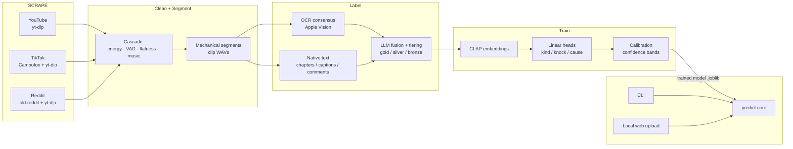
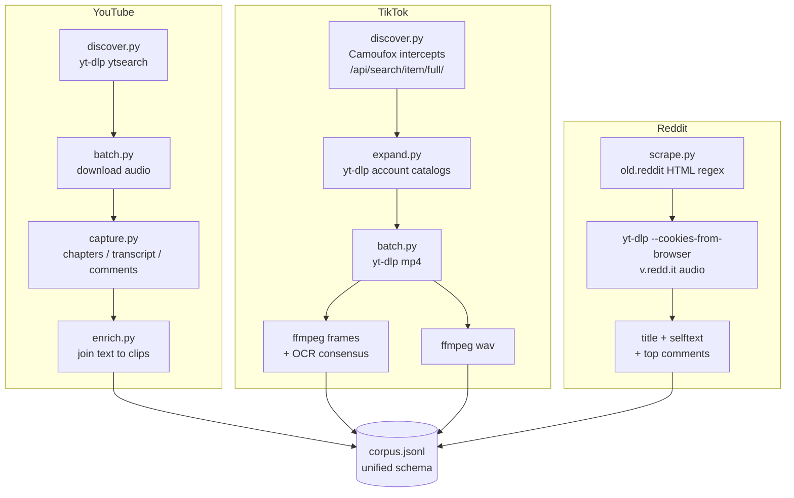
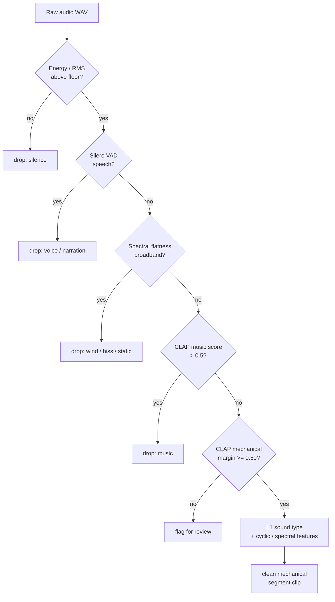
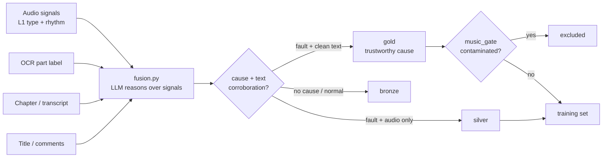
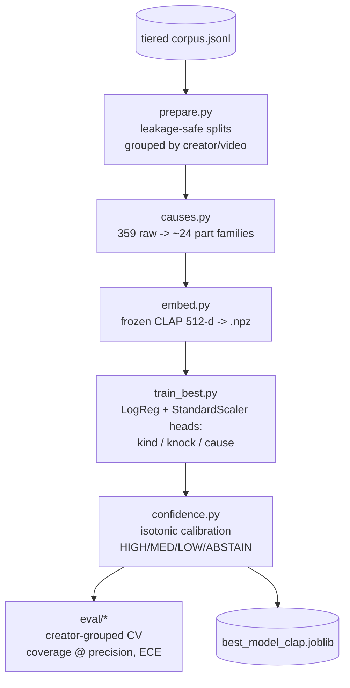
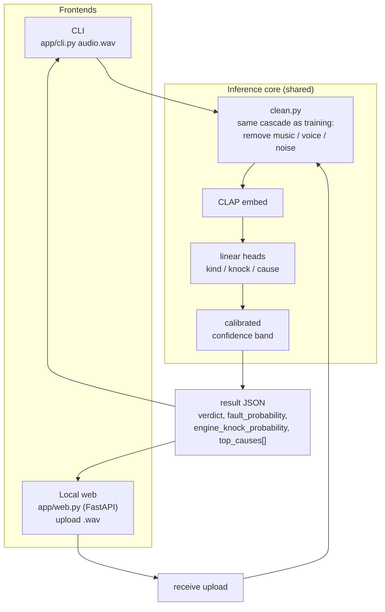
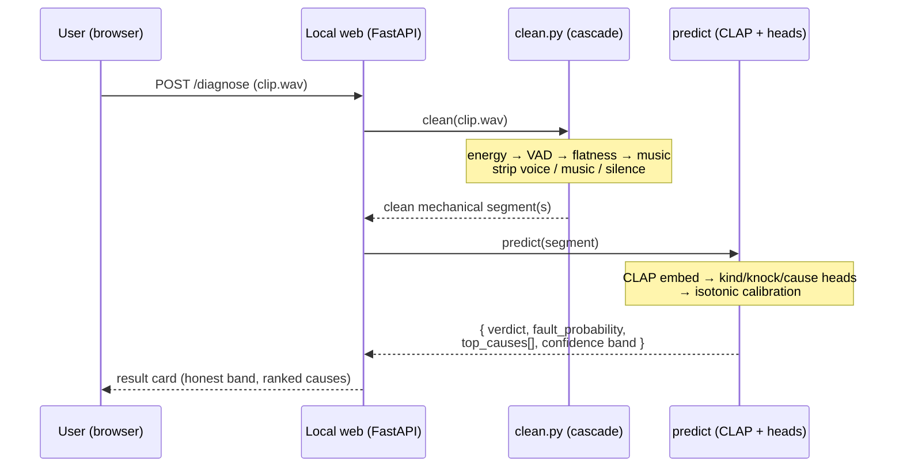

# Architecture Diagrams

Mermaid diagrams for the whole `car-diagnosis` system: the end-to-end pipeline, the
per-platform scrapers, the clean+segment cascade, training, and the abstracted
inference core shared by the CLI and the local web app.

---

## 1. End-to-end overview

---

## 2. Per-platform scrape paths

---

## 3. Clean + Segment cascade (CPU-first, cheap to expensive)

This identical cascade runs in **two places**: building the training corpus, and
cleaning a user-uploaded clip at inference. That symmetry is what keeps inference
matched to training.

---

## 4. Label fusion + trust tiering

Rule encoded in `fusion.py`: confidence ≥ 0.7 **requires** corroborating text;
sound-type alone caps at 0.45. Trust is multi-signal agreement, not model
self-confidence.

---

## 5. Training pipeline

---

## 6. Abstracted inference: one core, two front-ends

The CLI and the web app are thin shells. Both call the **same** `clean()` then the
**same** `predict()`. Adding a new front-end (or an API) means writing a shell that
calls `predict()` — never re-implementing cleaning or inference.

---

## 7. Sequence: a user uploads a clip to the local web app

